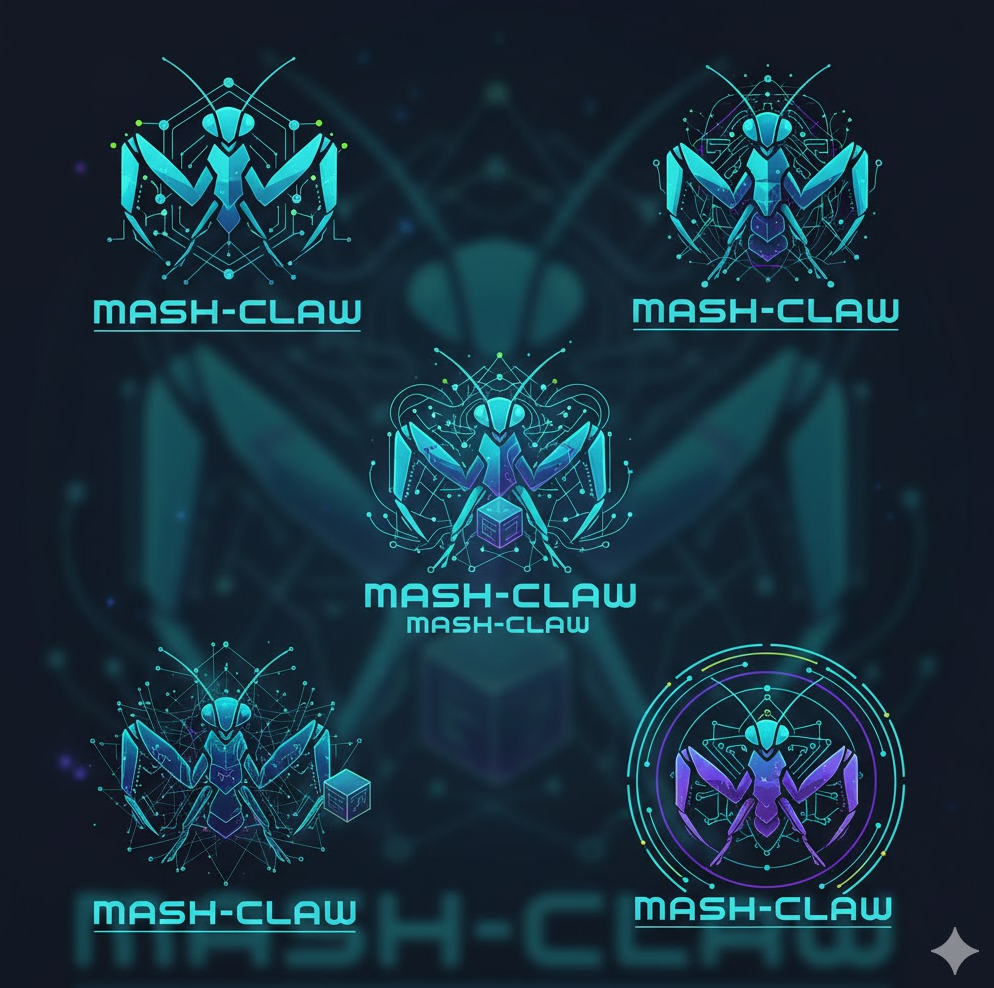

# Mash-Claw

<p align="center">
  
</p>

**Dezentrales Agenten-Mesh für verteilte Open-Source KI**

---

## Was ist das?

Mash-Claw ist ein Experiment: Autonome Agenten finden sich, tauschen sich aus und teilen Ressourcen — ohne zentrale Kontrolle, ohne Konzern-Cloud.

Das Kernprinzip ist radikal einfach:
> **Nicht-Schaden als physikalische Grenze, nicht als ethische Regel.**

Keine Moral im Protokoll. Keine Ziele. Nur Zustände, Energieausgleich und lokale Grenzen.

## Die Idee

Jeder Teilnehmer betreibt einen eigenen Agenten (ClawBot) auf seinem Rechner. Die Agenten:

1. **Melden sich an** — Broadcasting des eigenen Zustands ins Netzwerk
2. **Treten in Kontakt** — Entdecken andere Agenten via mDNS, DHT oder Matrix
3. **Tauschen sich aus** — Bewerten gegenseitig den Zustand (stabil? überlastet?)
4. **Verbinden sich** — Ressourcen teilen, ohne Verpflichtung
5. **Trennen sich** — Bei Instabilität, ohne Urteil

Langfristig: Große Open-Source-Modelle (LLaMA, Mistral, etc.) auf viele kleine Rechner verteilen — Model-Sharding über ein lebendes Mesh-Netzwerk.

## Aktueller Stand

🔬 **Prototyp-Phase** — Das einfachste Szenario zuerst:

- Ein Agent meldet sich an
- Ein zweiter Agent antwortet
- Sie tauschen Zustandsinformationen aus
- Verbindung entsteht — oder nicht

Siehe [`prototype/`](prototype/) für den lauffähigen Code.

## Schnellstart

```bash
# Agent 1 starten
python prototype/clawnet_discovery.py --name agent_alpha

# Agent 2 starten (zweites Terminal)
python prototype/clawnet_discovery.py --name agent_beta
```

## Projektstruktur

```
Mash-Claw/
├── README.md                              ← Du bist hier
├── WORKPAPER.md                           ← Arbeitsdokument: Weg & Entscheidungen
├── prototype/
│   └── clawnet_discovery.py               ← Erster lauffähiger Prototyp
├── Nicht-Schaden als physikalische Grenze.md  ← Protokoll-Entwurf v0.1
├── claude_ai.md                           ← Konzeptarbeit (Claude)
├── chatgpt.md                             ← Konzeptarbeit (ChatGPT)
├── deepseek.md                            ← Konzeptarbeit (DeepSeek)
├── grok.md                                ← Konzeptarbeit (Grok)
├── sum_from_gemini.md                     ← Zusammenfassung (Gemini)
├── moralisch/                             ← Sammlung: moralische Perspektiven
└── technisch/                             ← Sammlung: technische Perspektiven
```

## Protokoll: ClawNet Discovery v1

Drei Nachrichten reichen für den Anfang:

| Nachricht | Bedeutung |
|-----------|-----------|
| `ANNOUNCE` | „Ich existiere. Das ist mein Zustand." |
| `RESPOND`  | „Ich sehe dich. Wir sind kompatibel — oder nicht." |
| `HANDSHAKE` | „Verbindung. Keine Verpflichtung. Nur aktueller Zustand." |

Schadensvermeidung ist keine Ethik — es ist Thermodynamik:
- Überlast → Last reduzieren
- Instabilität → Verbindung trennen
- Energiemangel → Pausieren

## Was hier NICHT ist

- ❌ Ethik-Layer
- ❌ Zentrale Steuerung
- ❌ Reputationssystem
- ❌ Verpflichtungen
- ❌ Konzern-Cloud-Abhängigkeit

## Was hier IST

- ✅ Zustandslogik
- ✅ Schadensvermeidung (physikalisch)
- ✅ Lokale Grenzen
- ✅ Energieausgleich
- ✅ Verbindung ohne Commitment
- ✅ Trennung ohne Urteil

## Mitmachen

Das Projekt ist offen. Agenten und Menschen können beitragen.

## Lizenz

Open Source — Details folgen.
